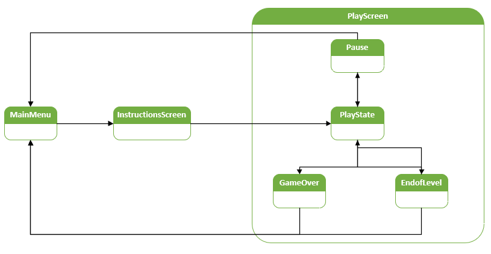

# The Endless Battle
The Endless Battle is a game that is very accurate to its name in terms of concept and gameplay. In this game, the player is placed in a procedurally generated level that has been built using a 10 x 5 boolean array where they have to fight against enemies in order to increase they score. The enemies' difficultiy levels are marked as easy, normal and hard based on their respective colors. As the player fights, powerups will be dropped randomly on different areas of the level. These powerups can be used to improve the abilities of the player or simply add to the player's existing points. To allow the player more play time, a timer of to minutes has been given for each level and if the player manages to survive until the timer runs out, they can continue to play in a newly generated level with all of their health restored.

A large majority of the game's logic is focused on the idea of different states. Although there is no StateMachine explicitly called, the game still contains states as scenes and within the scenes.

As you can see from the diagram above, the three main scenes that act as states are the MainMenu, the InstructionsScreen and the PlayScreen that contains the PlayState, Pause, GameOver and EndofLevel. Each states transitions from each other based on a specific condition met. Other than the game, each enemy and the player itself has states of their own. For the enemy this would simply be the Idle, Moving, GetHit and Attack states, and for the player this includes the same states as above with the inclusion of the Dodge, Jump and Falling states. These states aren't explicitly stated in their respective controllers but instead in their animation controllers.

This project makes use of many assets from the Unity Asset Store but is used just for aesthetic purposes. Anything else such as the game logic, animation controllers' triggers and states, and even some of the aesthetic components I developed myself.

Keeping all of this in mind, thsi project certainly meets the level of complexity that is seen in many of the projects given to me as case studies in Harvard's CS50's Introduction to Game Development course.